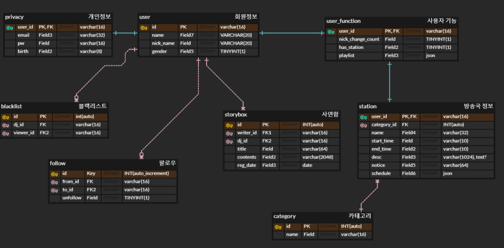

## 23.01.16
- 채팅 필터링 (네이버 오픈소스)
- 사연자가 방에 참여했는지 안했는지를 리스트로 확인 가능하게(내가 원하는 사람의 실시간 connection정보) - session서버 필요 ⇒ 접속중인지 알 수 있는 API 필요 (call by call은 불가)
    - 슈퍼챗기능(사연자) 채팅화면에 고정시키는 것………..!?
- 접속자 정보를 다 알고 있는 것이 중요
- 고정시간을 어떻게 관리할 것인가. 정해진 편성표 기준으로 추천알고리즘을 짜기 때문에 경고 보다 자율적인 규제가 가능할듯.
- 추천알고리즘
    - 로그인 이후에 메인화면에서 추천알고리즘을 보여주게 된다면 낭비되는 리소스가 많을 것. (효율적인 방법을 고려해보기)
    - 최대 접속자 채널을 어떻게 저장할것인지.
    - 구독자 수 sorting list == 세션에 있는 리스트 해서 출력
- 실시간 구독자 수 기능
    - 캐시서버를 사용해야함.
    - spring캐시로 사용 안됨
    - 로그 DB필요
    - 실시간으로 갱신을 할 건지, 아니면 하루에 한 번만 갱신을 할 건지 고민
    - 전체 유저 대비 DJ의 비율에 대해 시장조사(스푼라디오, 유튜브 …)
    - DJ 누구를 팔로우 언제 > DJ 누구를 팔로우 해제 언제 (log data)
    - 최초 시점을 DJ 개설할 때 구독자 수를 가져올 수 있음.(마이페이지에 방송정보를 입력할 때가 최초 시점)
    - DB에 적혀있는 log는 복원용,
    - 누가 팔로우 하면 버퍼 +1되는 api호출
    - 오차 감안 ~~~!!!!
    - 하루에 한번은 DB랑 맞는지 확인하고싶어 !!!!! (사람이 가장 없는 시간에 팔로우 log 정보를 분석해서 정확한 count 뽑아온다)
    - 이후 overwrite.(의 반복~~)
    - 일주일동안 아무도 나를 팔로우/팔로잉 하지 않을 경우 삭제 > 삭제하기 전에 백업table  > 그냥 프로필DB 에 저장 (해당 DB에 하루한번씩 overwrite)
    - 배치JOB , JOB Queue
- 전화번호 없어도 됩니다.
- 관리자 페이지 없어도 될듯 (Super계정 필요없음)
- 카테고리 알아서(meta table로 빼세요)
- reg_date 저장
- 개인의 편성표 ..
- sorting은 db에서 하지마라
- order by,like,delete는 없음
- 검색은 어떻게 검색할것인지, 뭘 검색할것인지 고려해볼것
- S22크기에 맞춰서 모바일 화면 하나 더 만드는걸로.

* Jira 정리
  * 한 주 시작이므로 계획을 짜고 시작했습니다.

## 23.01.17 
- [기능 명세서](https://www.notion.so/e5110b1024f04ad996daf0832b1a1fe6?v=ee53a0261e2f4789a8d6da4fccd5f1ae)
- [ERD, 데이터 설계](https://www.notion.so/ERD-2bcf4a10b26e4d4595cfda4358d0f1bd)

## 23.01.18 
```
        생성
        EntityManagerFactory emf = Persistence.createEntityManagerFactory("hello");

        EntityManager em = emf.createEntityManager();
        //code
        EntityTransaction tx = em.getTransaction();
        tx.begin();

        try {
            Member member = new Member();
            member.setId(2L);
            member.setName("HelloB");
            // 실행이 안되는 이유 트랜젝션을 안해주었기 때문에!!

            em.persist(member); // 저장하는 것
            tx.commit();
        }catch (Exception e){
            tx.rollback();
        }finally {
            em.close();
        }
        emf.close();
```

```
        수정
        Member findMember = em.find(Member.class, 1L);
				findMember.setName("HelloJPA");

        tx.commit();
```

```
        삭제
        Member findMember = em.find(Member.class, 1L);
        System.out.println("findMember.id = " + findMember.getId());
        System.out.println("findMember.name = " + findMember.getName());

        tx.commit();
```
```
        조회
        Member findMember = em.find(Member.class, 1L);
        em.remove(findMember);

        tx.commit();
```

```
package hellojpa;

import javax.persistence.EntityManager;
import javax.persistence.EntityManagerFactory;
import javax.persistence.EntityTransaction;
import javax.persistence.Persistence;
import java.util.List;

public class JpaMain {
    public static void main(String[] args) {
        EntityManagerFactory emf = Persistence.createEntityManagerFactory("hello");

        EntityManager em = emf.createEntityManager();
        //code
        EntityTransaction tx = em.getTransaction();
        tx.begin();

        try {
            List<Member> result = em.createQuery( "select m from Member as m", Member.class)
                    .setFirstResult(5)
                    .setMaxResults(8)
                    .getResultList();

            for (Member member : result){
                System.out.println("member.name = " + member.getName());
            }
            tx.commit();
        }catch (Exception e){
            tx.rollback();
        }finally {
            em.close();
        }
        emf.close();
    }
}
```

## 23.01.19
- 영속성 컨텍스트
엔티티를 영구 저장하는 환경 : DB에 저장하는 것이 아니라 엔티티를 영속성 컨텍스트에 관리되는 상태
```
- 비영속
Member member = new Member();
member.setId(1L);
member.setName("HelloJPA"); 
-----------------------------
- 영속
em.persist(member);
DB는 커밋을 해야 저장됩니다!!
```
- 이점 
    - 1차 캐시
    ```
    Member findMember1 = em.find(Member.class, 101L);
    Member findMember2 = em.find(Member.class, 101L);
    ```
---
- ERD Cloud 수정


